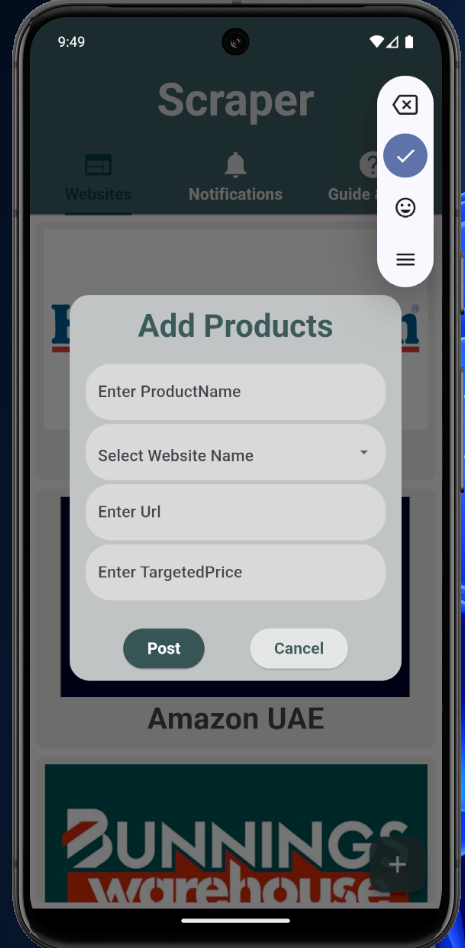
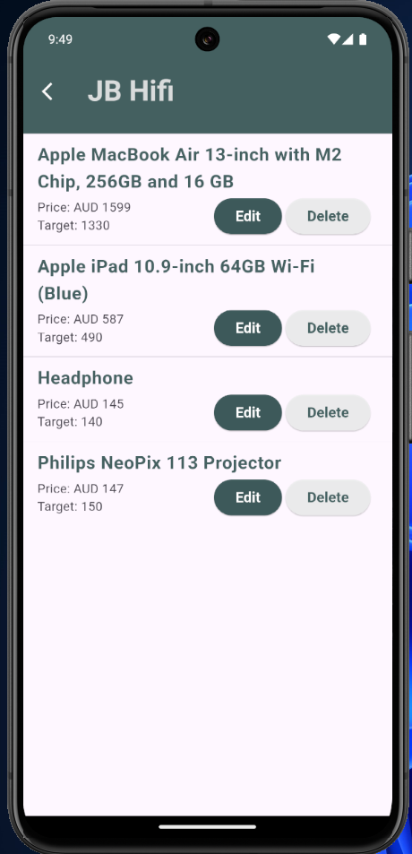
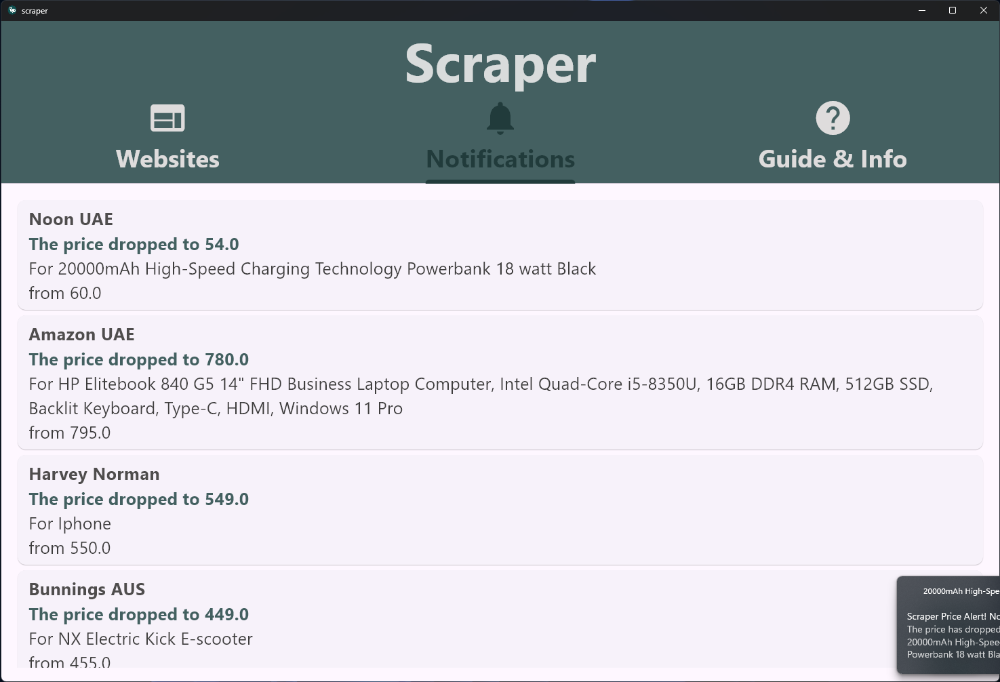
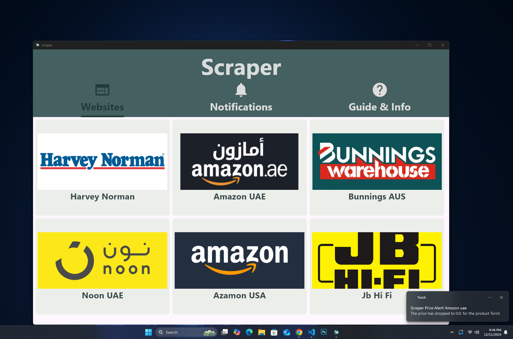
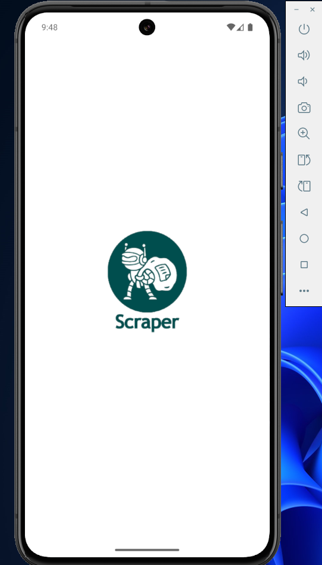
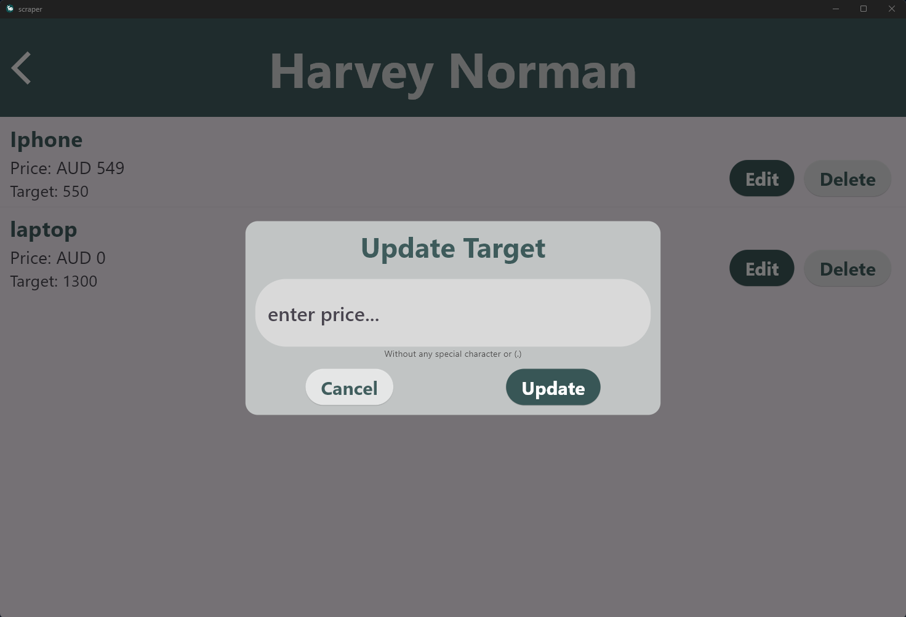

# scraper

Price Tracker Application Flutter
This app helps users keep track of product prices and notifies them when their desired price is reached. It uses Firebase for storing data, a Python script for checking prices, and Flutter for the user interface.

## App Screenshots

### Add Products Screen

### Price Monitoring Example

### Notification Example

### Windows Homepage Example

### Andriod Intro Example

### Update Price Example

Features
1. Add Products
Users can add product details, including:
  URL of the product
  Target price
  Model number
  All details are securely stored in Firebase Firestore.

2. Automated Price Monitoring
A Python script, deployed on a dedicated server, runs hourly around the clock.
  It retrieves product details from Firestore.
  Scrapes the latest prices from the provided URLs.
  Updates Firestore with the current product prices.

4. Smart Price Comparison
The system compares the actual price of the product with the user’s target price.
  If the current price matches or falls below the target price, a notification is triggered.

6. Instant Notifications
The application integrates Firebase Cloud Messaging (FCM) for real-time notifications.
  When the app initializes, it retrieves the user’s FCM token and stores it in Firestore.
  The Python script uses the token to send push notifications via Firebase Messaging, alerting users when their desired price is reached.

Technology Stack
  Frontend: Flutter
  Backend: Firebase Firestore, Firebase Messaging
  Automation: Python for web scraping and server-side operations
  Deployment: Hosted on a personal server
